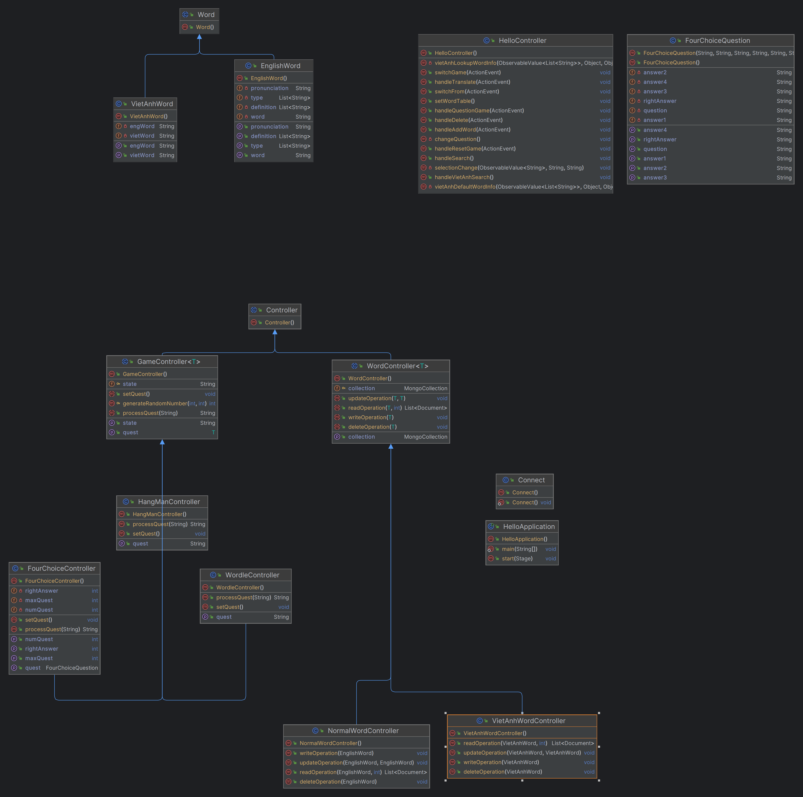

# Dictionary OOP

## Motivation
This is a project for midterm exam in OOP Programing Subject.

## Feature
- Read, Write, Delete a word.
- Translate with Google API.
- Store word in MongoDB.
- Search word by querying data from MongoDB and store in a Hash Map.
- Four answer question game.
- Basic interface.

## Instruction
To use this project, please install an IDE (IntelliJ recommend), install Java SDK. Then open this repo in IDE and run.

## Demo
- To see the demo video, please follow this [link](https://youtu.be/uljiHnQ4hp0).

## Diagram
- Here is our project's classes diagram.

## Improvement
- Setup a more efficient UI.
- Setup Hangman Game, Wordle Game.
- If you have any idea, or meet a bug, please raise an issue.

## Contributor
- Trần Mạnh Duy 22026567
- Phạm Khánh Linh 21020080
